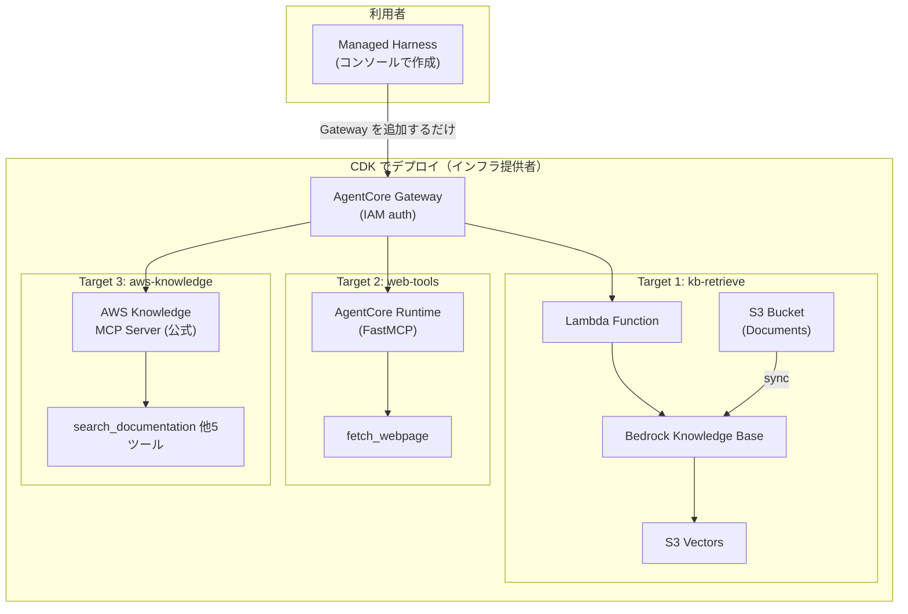

# AgentCore RAG Gateway Kit

AgentCore Managed Harness 向けのツール基盤を CDK でデプロイする。
Gateway を 1 つ立てておけば、誰でもコンソールから Harness を作って繋ぐだけで RAG エージェントが使える。

## アーキテクチャ



## 提供ツール

| Target | ツール名 | 説明 | 実装 |
|--------|---------|------|------|
| kb-retrieve | `retrieve_documents` | ナレッジベースからドキュメント検索 | Lambda |
| web-tools | `fetch_webpage` | Web ページのテキスト取得 | FastMCP on Runtime |
| aws-knowledge | `search_documentation` 他 | AWS 公式ドキュメント検索 | AWS ホスト済み MCP Server |

## 前提条件

- CDK Bootstrap 済み (`npx cdk bootstrap`)
- Node.js 18+
- Docker（Runtime コンテナビルド用）
- デプロイリージョン: us-east-1

## デプロイ

```bash
# 依存インストール
npm install

# テンプレート確認
npx cdk synth

# デプロイ（2スタック）
npx cdk deploy --all
```

## デプロイ後の手順

### 1. Knowledge Base の同期

```bash
# DataSource ID と KB ID は CDK Output から取得
aws bedrock-agent start-ingestion-job \
  --knowledge-base-id <KnowledgeBaseId> \
  --data-source-id <DataSourceId>
```

### 2. ドキュメントの追加

```bash
# S3 バケットにドキュメントをアップロード
aws s3 cp my-document.txt s3://<DataSourceBucketName>/

# 同期を再実行
aws bedrock-agent start-ingestion-job \
  --knowledge-base-id <KnowledgeBaseId> \
  --data-source-id <DataSourceId>
```

### 3. Managed Harness の作成（コンソール）

1. AWS コンソール → Bedrock → AgentCore → Managed Harness
2. 「Create harness」をクリック
3. 設定:
   - **Model**: Claude Sonnet / Haiku など
   - **System Prompt**: 自由に設定（例: 「ナレッジベースと Web を使って質問に回答してください」）
   - **Tools**: CDK Output の Gateway を追加
4. テスト:
   - KB 検索: 「AgentCore の Gateway について教えて」
   - Web 取得: 「https://example.com の内容を教えて」
   - AWS ドキュメント: 「Lambda の同時実行数の上限は？」

## Gateway にツールを追加する

`lib/rag-gateway-stack.ts` に Target を追加するだけで拡張可能。

### Lambda ツールの追加例

```typescript
gateway.addLambdaTarget('MyNewTarget', {
  gatewayTargetName: 'my-tool',
  lambdaFunction: myFunction,
  toolSchema: agentcore.ToolSchema.fromInline([{
    name: 'my_tool',
    description: 'ツールの説明',
    inputSchema: {
      type: agentcore.SchemaDefinitionType.OBJECT,
      properties: { /* ... */ },
    },
  }]),
});
```

### MCP Server ターゲットの追加例

MCP Server ターゲットは L1 構成を使用する（L2 の `fromIamRole()` が `iamCredentialProvider` を出力しないため）。

```typescript
import * as bedrockagentcore from 'aws-cdk-lib/aws-bedrockagentcore';

new bedrockagentcore.CfnGatewayTarget(this, 'MyMcpTarget', {
  gatewayIdentifier: gateway.gatewayId,
  name: 'my-mcp-server',
  targetConfiguration: {
    mcp: {
      mcpServer: {
        endpoint: 'https://your-mcp-server.example.com',
      },
    },
  },
  credentialProviderConfigurations: [{
    credentialProviderType: 'GATEWAY_IAM_ROLE',
    credentialProvider: {
      iamCredentialProvider: {
        service: 'bedrock-agentcore', // or 'execute-api'
      },
    },
  }],
});
```

## スタック構成

| スタック | リソース |
|---------|---------|
| KnowledgeBaseStack | S3 Vector Bucket, Vector Index, KB, DataSource, S3 Bucket |
| GatewayStack | Gateway (IAM), 3 Targets, Lambda, Runtime |

## クリーンアップ

```bash
npx cdk destroy --all
```
